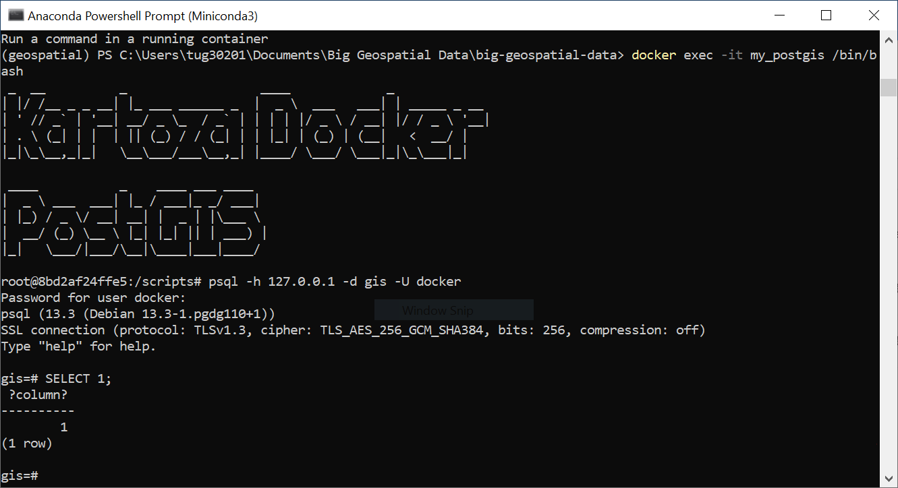
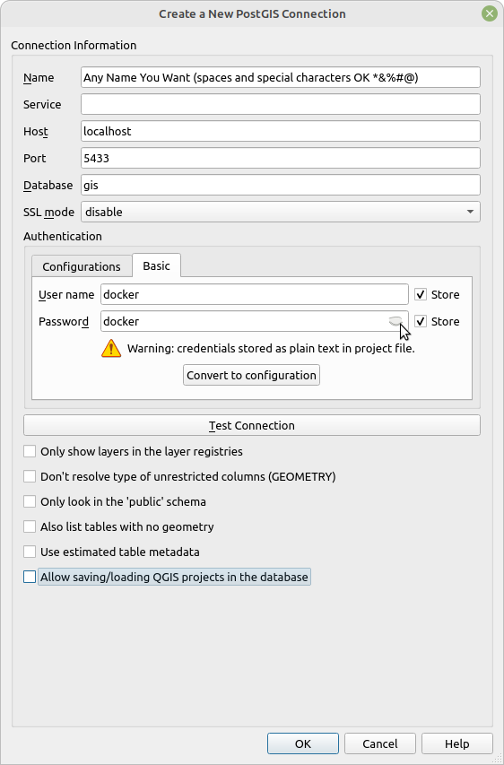
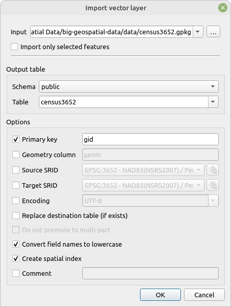

# Introduction to Spatial Databases with PostGIS

Database systems can make spatial operations much simpler, and are more efficient to handle a large number of records. Working in a large spreadsheet or CSV can be quite difficult. Shapefiles have a size limit of 2 GB. Working with large spatial layers in a spatial database system such as PostGIS is both easier and much more efficient. There are many available relational database management systems (RDBMS) and a growing number of NoSQL (non-relational) database systems. We will focus on the PostGIS extension to PostgreSQL, arguably the most popular open source spatial RDBMS. (MySQL and its fork, MariaDB, continue to outpace PostgreSQL as a general RDBMS). We will learn about directly querying a database, then learn how to query a database using Python. You will learn some basic SQL suitable for spatial analysis. If you have already taken GUS 8067 - Spatial Database Design, some of this will already be familiar to you.

## 1. Installing Postgres/PostGIS

In this class we will run PostGIS in a Docker container. Docker is a virtualization technology that allows you to run a complete operating system inside another operating system. Docker has become reasonably widespread in the data science world because it is possible to share a Docker container with a configured server, preloaded data, and a development environment, making it very easy for other researchers to reproduce your analysis without installing a lot of software. Of course, if you don't have Docker installed, you will have to install it first, but once you do it gives you a "no installation" way to run a Postgres server, web server, Python development environment, or anything else that someone has already created a Docker container for.

Please follow my instructions for [Creating a PostGIS Server in Docker](https://leehach.github.io/spatialdb/creating_a_postgis_server_in_docker).

A PostGIS server can be created in several different ways. Briefly:

* PostGIS can be installed natively, i.e. installed to the OS so that your laptop (or other computer) is an actual PostGIS server. The easiest way to do this is on Windows or Mac is with the EnterpriseDB installer: <https://www.enterprisedb.com/downloads/postgres-postgresql-downloads>
* PostGIS can be run in a virtual machine. I recommend using OSGeoLive, a Linux-based OS that comes with a wide variety of open source GIS software and data preinstalled, including a full PostGIS server with several spatial databases. Instructions for setting up OSGeoLive in VirtualBox are available here: <https://live.osgeo.org/en/quickstart/virtualization_quickstart.html>
* PostGIS can be run in a Docker container. Use my instructions linked above.

There are two reasons for using Docker in this course. The first is that I have found that of the above three setup methods, this is probably the easiest. The second, more important reason, is that Docker is an increasingly important data science tool. Researchers, developers, and data scientists are increasingly using Docker to deliver a fully configured environment with software (not necessarily PostGIS), development environments, and data ready-to-go. You will probably encounter it elsewhere, and this experience will be useful.

The Docker instructions above also show how to connect to the database from the DBeaver management client. You can download and install DBeaver from <https://dbeaver.io/download/>.

You may see instructions online telling you to run the command `CREATE EXTENSION postgis;` when setting up a PostGIS server. You do *not* have to run this command if you use the Kartoza PostGIS container per the instructions linked above.

You can connect to the database from a variety of clients, including QGIS, ogr2ogr, and Python. When connecting from your local machine, the connections settings for any client are:

* Host: `localhost`
* Port: `5433`
* Database: `gis`
* User: `docker`
* Password: `docker`

This tells the client to attempt to connect to the database `gis` on port `5433` on your local machine (`localhost`) using the username and the password `docker`. Obviously, connecting to other PostGIS servers will require different settings.

## 2. Connect to the `gis` Database Using `psql`

Postgres comes with a native command line client `psql`. When you run it, you can issue commands in the database. We will view some basic `psql` commands.

Lauch a terminal (Mac Terminal, Windows Command Prompt, Windows Power Shell, etc.). Run a shell inside the container with the following command:

```sh
docker exec -it my_postgis /bin/bash
```

This assumes that you followed my instructions in creating the Docker container, and named the container `my_postgis`. If you named it something different, you will see `Error: No such container: my_postgis`. If you have the correct container name and still get that error, the container may not be running. Refer to the PostGIS setup instructions for starting and stopping the container, or open Docker Desktop and check the list of containers there to see if it is running.

You should see a banner for the container, and a prompt that begins `root@...`.

\ 

You can now use `psql` inside the container to connect to the PostGIS server with the following command:

```sh
psql -h 127.0.0.1 -d gis -U docker
```

You will be prompted for the password which is also `docker`. You will then get the `psql` prompt, which begins with the name of the database you are connected to (`gis` in this case). Refer to the screenshot above.

Now give a SQL command at the prompt:

```sql
SELECT 1;
```

This is a very basic SQL statement. It does not query any table, it's just selects an expression (the value `1`) into an unnamed column. It is very uninteresting, but it does prove that we are able to successfully issue SQL commands and 
have the database evaluate them and return a resultset.

Note that the semicolon (`;`) is required as a command terminator in `psql`. SQL statements can be complex and for ease of entry and reading are often typed on multiple lines. Hitting Enter does *not* cause the SQL statement to be evaluated unless the line ends with a semicolon.

Now lets issue some basic commands. `psql` has a number of "meta-commands" that begin with a backslash (`\`), and allow you to get information on database objects or perform actions *other than* SQL commands.


```sh
\l
```

This command lists all databases with: You should see `gis`, `postgres`, `template0`, and `template1`. `gis` si the database we are currently connected to, and the one we will work in for the remainder of this exercise. `postgres` is the maintenance database, which is present in every PostgreSQL cluster, and should not be used to store data. the template databases allow you to configure them to use as a template for other databases that you create. They should not be used to store data.

```sh
\dt
```

This command lists all tables in the current database. As we haven't loaded any data yet, you should see only a small number of PostGIS maintenance tables such as `spatial_ref_sys`.

```
SELECT version();
SELECT PostGIS_Full_Version();
```

These commands provide information on the installed version of PostgreSQL and the installed version of PostGIS, including supporting libraries such as GEOS and GDAL.

Don't issue this command right now, but when you are ready to quit, you can do so with `\q`. This will exit `psql` and return to the container shell. When you are done working in the container, you can use `exit` at the prompt to exit the container. Note that the container is still running, but you are no longer connected to its terminal.


## 3. Load Spatial Layers into the Database

As shown in the previous exercise, we can create database tables using SQL commands. When working with research data, we often need to import prexisting data (frequently publicly available). This section is about loading spatial layers such as shapefiles and GeoPackages into a spatial database. There are two GeoPackages in the data folder, a polygon layer "census3652.shp" and a point layer "philadata3652.shp". We will demonstrate two ways to import them, one using a GUI tool (QGIS) and one using a command line tool (`ogr2ogr`).

### 3.1. Load a Spatial Layer Using QGIS

#### 3.1.1. Connect to the Database

Before you can use QGIS to load, display, and anlayze data in your PostGIS database, you need to create a connection to the database. You can open the Create a New PostGIS Connection dialog in two ways:

1. In the Browser pane in QGIS, right-click PostgreSQL (might be called PostGIS in some versions of QGIS) and select New Conection….
2. Hit `Ctrl` + `Shift` + `D` to open the Data Source Manager, and under the dropdown list of connections, hit the New button.

You will see the following dialog. The connection settings are the same ones used earlier to connect to DBeaver. Some notes follow.

\ 

* **Name:** This can be anything you want. Name it something that will be clear and easy to understand, and don't worry about being verbose. As you do more research, you may make use of multiple PostGIS databases, so don't name it something generic like "PostGIS"! Including the server name, database name, or a project name if this database will hold data for a specific project, are good ideas.
* **User name** and **password**: Click the Basic tab to display the user name and password textboxes. For this database---a local database used for learning purposes---we don't care about security, so click the checkboxes to Store the user name and password. This will save you from having to input your credentials every time you add a layer from this database. If you are working with a production database, make sure to follow your organization's security policy.

You might want to hit Test Connection and make sure everything is working before hitting OK.

#### 3.1.2. Use DB Manager to Upload Your Data

1. Open DB Manager in QGIS using the Database→DB Manager… menu.
2. In the left-hand Providers pane, expand the PostGIS tree, then expand the tree for the database connection you just added. Information about the database should load in the right-hand pane.
3. Click the Import Layer/File toolbar button. The Import Vector Layer dialog will appear.

The import dialog allows you to upload a layer currently displayed in QGIS (layers loaded in the current project, if any, will appear in the Input dropdown) or a file on your hard drive. Use the file browser (click the button with three dots to the right of the dropdown) to select `census3653.gpkg` from the course data folder.

Settings in the dialog should look like this. More explanation follows.

\ 

* **Schema:** Postgres uses schemas to organize tables and other database objects. The import dialog defaults to the public schema, and that is the one we will use.
* **Table:** The table name will default to the name of the layer being imported, minus any file extension. You can rename the table here, but the table name should not include special characters or spaces. Postgres table names should use `lower_case_with_underscores`. Note that we have checked **Convert field names to lowercase** below, so even if the table name has uppercase characters, they will be folded to lowercase.
* **Primary key:** Postgres developers prefer the name `gid` for the primary key of spatial tables.
* **Target SRID:** Although we are retaining the original projection, we could reproject the data during the load process by setting a different target SRID.
* **Create spatial index:** Spatial indices will speed up your spatial queries. There is almost never a reason to *not* create a spatial index right away.

### 3.2 Load a Spatial Layer Using `ogr2ogr`
First create a database of phila through the command,
create database phila;
Then you can import the shapefiles into the database of phila.
1. For windows users,Download
the
tool
to
convert
the
shapefile
to
spatial
data
base
table,
http://download.osgeo.org/postgis/windows/. Make sure put the exe file to the folder of the your
postgres. For example, on my computer, C:\Program Files\PostgreSQL. Then double click it to
install the tool,
Then let’s connect to the database in the postgis-bundle tool, by click ‘View Connection
details’,Fill the table using your username, password, localhost, and db name.
Then you need to enable the extension of PostGIS by typing in the PSQL shell,
CREATE EXTENSION POSTGIS;
After enabling the PostGIS, then you can import the shapefile to PostGIS table. Click the
“Add File”, and select the shapefile you want to convert to Postgres database table, and set the
“SRID” as the epsg code of the shapefile.Click the add File and select one shapefile, then you can click import. You can then check your
database in the PSQL shell,
\c phila;
\dt
You will find you have the table imported successfully.
Reference: https://postgis.net/workshops/postgis-intro/loading_data.html
For Mac users
You can just stay in the terminal and use the command line to convert the shapefile into
Postgres table. First cd to the directory of your shapefile, and then type in,Convert the shapefile of philadata3652.shp into a PostGIS table. First cd to the directory of the
philadata.shp file, and type in,
shp2pgsql -s 3652 philadata3652> philadata.sql
You will find that there is a file “philadata.sql” created. This is a series of Postgres commands.
We need to enable the PostGIS before running these commands. Open the “philadata.sql” using
text editor, and add the statement on top,
CREATE EXTENSION postgis;
Then you can run the .sql and import the shapefile into Postgres database table,
psql -h localhost -U postgres -d phila -p 5432 -f philadata.sql
-h: the host of localhost
-U: the username
-d: the database name
-p: portal, default of 5432
-f: the .sql file
Convert the shapefile of the census tract of Philadelphia into the table
shp2pgsql -s 3652 census3652> census3652.sql
Then you will find there is a census3652.sql file. The next step is to run the commands and
insert the data to your database, make sure you start the PostGIS service first in your psql terminal,
CREATE EXTENSION postgis;Then you can run the .sql in your Mac/Linux terminal,
psql -h localhost -U postgres -d phila -p 5432 -f census3652.sql
You can check if the shapefile has been imported into the database in the terminal,
\c phila;
\dt

## 4. Run Spatial Queries in PostGIS

After you imported the shapefiles into postgres tables, we can then get started to do our
queries using SQL.
4.1 Check the number of records in your point shapefile
select count(*) from philadata3652;4.2 Preview the structure of the table
\d philadata3652;
Now we are ready for the spatial database tables. Then we can use the database tables to do
the spatial join between the point shapefile and the census tract polygon file. Here is an example
of counting the number of points in each polygon,
SELECT census3652.tractce, count(philadata3652.panoid)
FROM philadata3652
LEFT JOIN census3652 ON ST_Intersects(census3652.geom, philadata3652.geom)
GROUP BY census3652.tractce;
We can make our statement shorter,
SELECT c.tractce, count(p.panoid)
FROM philadata3652 p
LEFT JOIN census3652 c ON ST_Intersects(c.geom, p.geom)
GROUP BY c.tractce;If we want more attribute to be saved, then you can use the statement of,
SELECT c2.tractce, c2.countyfp, c2.statefp, c2.geom, t.num
FROM (
SELECT c.tractce, count(p.panoid) as num
FROM philadata3652 p
LEFT JOIN census3652 c ON ST_Intersects(c.geom, p.geom)
GROUP BY c.tractce) t
JOIN census3652 c2 ON c2.tractce = t.tractce limit 4;
Since we want to save the result as a new shapefile, we need to create a new table of the
queried result,
CREATE TABLE CensusPntNum AS
SELECT c2.tractce, c2.countyfp, c2.statefp, c2.geom, t.num
FROM (
SELECT c.tractce, count(p.panoid) as num
FROM philadata3652 p
LEFT JOIN census3652 c ON ST_Intersects(c.geom, p.geom)
GROUP BY c.tractce) t
JOIN census3652 c2 ON c2.tractce = t.tractce;
Then you will find you have a new table “censuspntnum” created,You can check the structure of the newly created table by,
We can use the same commands to export the table to a shapefile,
Let’s save the table as a shapefile, using the following command in terminal (not your psql
command),pgsql2shp -u postgres -h localhost -P 5424796 -f pntshp phila "SELECT
* FROM censuspntnum;"
-u: the username of the database
-h: the host, here is the localhost
-P: is your password
-f: the file you going to save
phila: the database name
