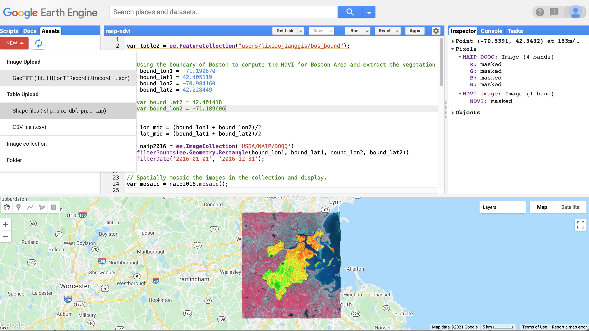

# Google Earth Engine

1. Go to <https://earthengine.google.com/>.
2. Click Get Started.
3. You will be asked to choose a Google Account to login. Please use a personal Gmail to register, not your Temple-affiliated Google Account.
4. Select Use with a Cloud Project.
5. Select Unpaid usage, and set the project type to Academic & Research.
6. Select Create a new Google Cloud Project.
    * If you are using a personal account, select No Organization. This is not a free entry field.

When you finish you will be taken to the Earth Engine Code Editor. Please take the tour. (If this is your first using Earth Engine, you should be prompted to take a tour of its features.)

## Your first GEE App

```javascript
// Load an image.
var image = ee.Image('LANDSAT/LC08/C01/T1/LC08_044034_20140318');

// Center the map on the image.
Map.centerObject(image, 9);

// Display the image.
Map.addLayer(image);
```

## Show images of different band combinations

```javascript
// Load the image from the archive.
var image = ee.Image('LANDSAT/LC08/C01/T1/LC08_044034_20140318');

// Define visualization parameters in an object literal.
var vizParams = {bands: ['B5', 'B4', 'B3'], min: 5000, max: 15000, gamma: 1.3};

// Center the map on the image and display.
Map.centerObject(image, 9);
Map.addLayer(image, vizParams, 'Landsat 8 false color');
```

## Filter by Date

`ee.ImageCollection` has a `.filterDate` method which is used to restrict images to a specific data range. In the following code, Landsat images are collected for the second have of 2013 and then the median pixel value is take across those images:

```javascript
Map.addLayer(ee.ImageCollection('LANDSAT/LC8_L1T')
    .filterDate('2013-06-01','2013-12-31')
    .median(),
{'bands': ['B5', 'B4', 'B3'], 'min':6000, 'max':18000});

Map.setCenter( -75.15612903867837, 39.99187073445269, 7);
```

Use variables to improve script readability. To define variables in Javascript, you must begin the line with `var`. The following code is the same as above, but variables are used to collect the images, filter by date, and find the median. The final call to `Map.addLayer` passes in the variable `median` instead of a the original image extraction and manipulation:


```javascript
var landset8 = ee.ImageCollection('LANDSAT/LC8_L1T');
var secondHalf2013 = landset8.filterDate('2013-06-01','2013-12-31');
var median = secondHalf2013.median();

Map.addLayer(median, {'bands': ['B5', 'B4', 'B3'], 
    'min':6000, 
    'max':18000});

Map.setCenter( -75.15612903867837, 39.99187073445269, 7);
```

## Upload a Shapefile to GEE

You can upload a shapefile to GEE. We will do so with the Philadelphia's city limits and use it as a mask for the raster data. The upload *must be* a shapefile and *must be* in WGS 84 (EPSG:4326). Use QGIS or ogr2ogr to convert city_limit.gpkg to a shapefile and to transform it from Pennsylvania State Plane South (EPSG:2272) to WGS 84 (EPSG:4326). Call the file phila_city_limit.shp. ciStore the converted file in the repo's output folder (which is ignored by git) or another folder outside of the repo.

In the upper left click the Assets tab, and then New→Table Upload→Shape files. Select the phila_city_limit.shp files. The GEE shapefile uploader is somewhat stupid compared to desktop GIS or GeoPandas in that you have to select all the components of the shapefile. You can't just select the SHP file and have the uploader find the DBF, SHX, etc.

You can check the ”Assets” and find your upload shapefile, then click the arrow of “input to script” to add it in your script.

\ 

## Mask Using a Shapefile

The following code uses the uploaded shapefile to mask an image and calculate the NDVI within the area.

Begin by pasting the code into the script. Then go to your assets tab. Find the asset (phila_city_limit) and click the right arrow. You will see an **import** at the top of the script. The vector layer is being imported as the variable `table`.

```javascript
var naipSummer2017 = ee.ImageCollection('USDA/NAIP/DOQQ')
  .filterDate('2017-06-01', '2017-09-30');

// Spatially mosaic the images in the collection and display
var mosaic = naipSummer2017.mosaic();

var red = mosaic.select('R');
var nir = mosaic.select('N');
var ndvi = nir.subtract(red).divide(nir.add(red)).rename("NDVI");

// Display the result.
var ndviParams = {min: -1, max: 1, palette: ['8B0000','FF0000', 'FF4500', 'FFFF00', '00FF00','008000', '006400']};
Map.addLayer(ndvi.clip(table), ndviParams, 'NDVI image');
```

If you click on the import entry, you can select "Show generated code". For me this generated:

```javascript
var table = ee.FeatureCollection("projects/ee-test-big-geospatial-data/assets/phila_city_limit");
```

You could paste this (the version generated in *your* GEE account) directly into your script, or reuse it in another script.

## Extract Vegetation

This script extracts vegetation, which are pixels with NDVI > 0.

Use imports again to import philly_city_limit at the top of the script, or paste the code generated in the last script.


```javascript
var bound_lon1 = -75.32775947308963
var bound_lat1 = 39.86274244886936
var bound_lon2 = -74.91150572124518
var bound_lat2 = 40.133542013249546

var naipSummer2017 = ee.ImageCollection('USDA/NAIP/DOQQ')
  .filterBounds(ee.Geometry.Rectangle(bound_lon1, bound_lat1, bound_lon2, bound_lat2))
  .filterDate('2017-06-01', '2017-09-30');

// Spatially mosaic the images in the collection and display.
var mosaic = naipSummer2017.mosaic();

var red = mosaic.select('R');
var nir = mosaic.select('N');
var ndvi = nir.subtract(red).divide(nir.add(red)).rename("NDVI");

var thres = ndvi.gte(0).rename('thres')

// Display the result.
var ndviParams = {min: 0, max: 1, palette: ['yellow','green']};

Map.addLayer(thres.clip(table), ndviParams, 'Vegecover image');
```

## Export Results to Google Drive

Add can add this statement to the end of your script to export the image to Google Drive. Use your variable name to replace the `thres`. Then check the Task on your right panel, and click Run.

```javascript
Export.image.toDrive({
  image: thres,
  description: "vegcover",
  scale: 10
});
```

Note that the clipped raster image for Philadelphia is too large. The export creates a task in the Task pane, but when I click Run, the export fails with the message:

> Error: Export too large: specified 8030040147504 pixels (max: 100000000). Specify higher maxPixels value if you intend to export a large area. (Error code: 3)

If you would like to experiment with this, you can upload a smaller mask (a neighborhood or Census tract in Philadelphia). You do not have to do this to complete the assignment.

## Deliverables

The final script finds tree canopy (vegetation, NDVI > 0) for Philalphia. Pick a city (other than Philadelphia) to explore. Find a shapefile for your city to use as a mask. Change the final script to create an image of the tree canopy for your city. Submit your final script and a screenshot of the result in the Earth Engine Code Editor (script + image display in the map pane).


