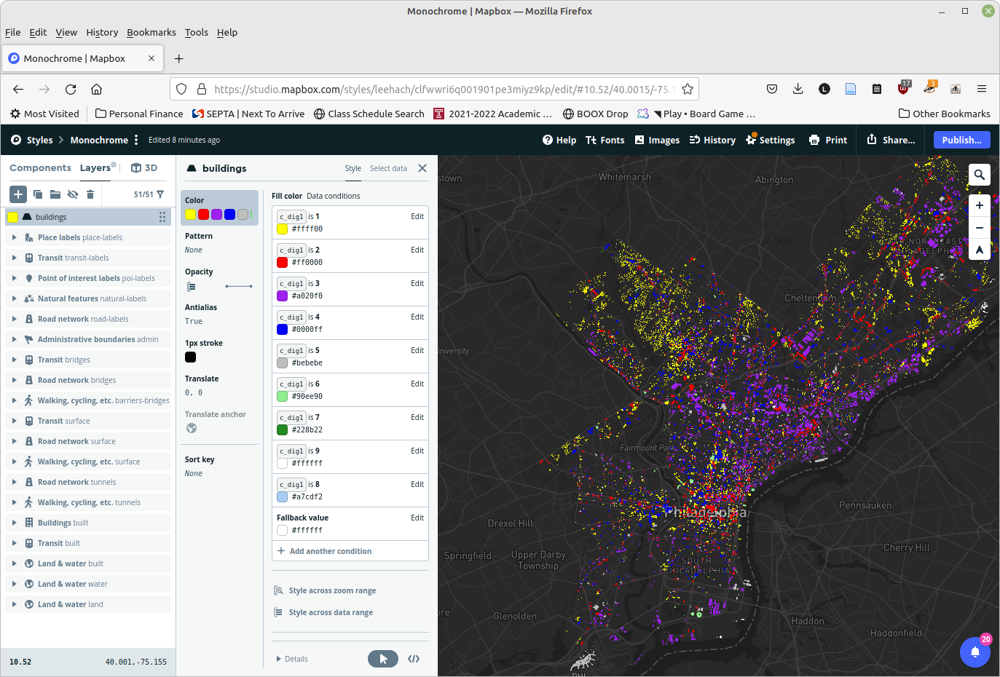

## Lab 9. Visualizing half-million building blocks online

This week we are going to talk about using Github and publish your webpage online. We have already created interactive choropleth map using localhost, but our webpage is not publicly accessible yet. After this week, we will be able to publish it through github and every other people can see your geoviz. You will be able to visualize half-million building blocks in Philadelphia through Mapbox and host your webpage on Github

> WARNINGS: This exercise needs review. There is a significant amount of data preparation which delays getting to the interesting part, which is using MapBox Studio to style a map and making the end result publicly available via GitHub Pages. The spatial join necessary to complete this lab takes 5-11 seconds to process in Python, or 1-2 months for the half million blocks. It should not be attempted. See the CHANGELOG for more information.

## 1. Prepare the data

### 1.1 Download the datasets

You need the building footprint and the land use layers in Philadelphia. You can download the these from the [PASDA website]([https://www.pasda.psu.edu/). A simple way to do so is to use `wget` your AWS terminal (or other Linux environment).

The Philadelphia building data summary can be viewed at <https://www.pasda.psu.edu/uci/DataSummary.aspx?dataset=146>. If you right-click the Download link, you will see that the dataset is available at <https://www.pasda.psu.edu/download/philacity/data/PhiladelphiaBuildings2017.zip>. (Alterntively, the datasets can be downloaded from the FTP server at <ftp://ftp.pasda.psu.edu/pub/pasda/philacity/data/PhiladelphiaBuildings2017.zip>.)

First, create a folder to hold your data. Assuming you are at the root folder of your EC2 instance, create and navigate into the folder:

```sh
mkdir data
cd data
```

We need to download this dataset, unzip it, and remove the ZIP (so that we don't take up too much space in our cloud instance).

```sh
wget ftp://ftp.pasda.psu.edu/pub/pasda/philacity/data/PhiladelphiaBuildings2017.zip
unzip PhiladelphiaBuildings2017.zip
rm PhiladelphiaBuildings2017.zip
```

You can copy the `wget` command to your terminal. I recommend typing in the `unzip` and `rm` commands and using **tab completion** to avoid typing the full filenames. This may seem pedantic, but as practicing typing out the commands, and in particular practicing using tab completion, will help you become more comfortable working at the command line.

Now go back to PASDA and find the download link for the Philadelphia Planning - Land Use dataset. (The filename should be "PhillyPlanning_Land_Use.zip".) Download and unzip this file as well.

<!--You can then use the Rtree to do the intersection of the building footprint and land use map to assign land use information to the building footprint. You are not required to do this, but if you can finish this part in Python and submit your notebook you will get extra two points.

If you don't want to do that, you can download the shapefile I prepared from [here](https://drive.google.com/file/d/1UZB-1zH0vh37ALYfojm31I9pA_Azkouh/view?usp=sharing).-->

### 1.2 Copy Land Use Codes to the Buildings and Convert to GeoJSON

Use the R-tree method that we learned in Lab 3 to add the land use to the buildings layer. ***In most cases, the building footprints do not fall cleanly within a parcel in the land use layer.*** You only want to assign one land use to each building, so you will have to determine a method to determine the "best" land use class for each. The easiest will be to use the centroid of the building footprint. A more complex one would be to do a spatial intersection and assign a land use based on the majority of the buildings area. However, in many cases, adjacent parcels have the same land use, so for our present purposes we do not have to worry too much about this.

The fields that you are interested in copying are "C_DIG1", "C_DIG2", and "C_DIG3", which show the 1-, 2-, and 3-digit codes for the parcel land use. Metadata showing the land use codes is available at <https://metadata.phila.gov/#home/datasetdetails/5543864420583086178c4e74/>. An example from the metadata shows that the codes are usually represented as "Example: 1= Residential, 1.2 = Residential Medium Density, and 1.2.1 = Residential Rowhouse." However, in the land use layer, the fields are integers and the points are omitted, so these would appear as `1`, `12`, and `121`. Keep them as integers when you copy them.

In this lab, we are going to use Mapbox to visualize the building block shapefile. However, on web-based GIS system, shapefile is not a well-supported format. Therefore, when doing the spatial join, you should export the new dataset using the driver `"GeoJSON"`. *If you do not do this,* you can use ogr2ogr to convert the building layer to GeoJSON. Remember that ogr2ogr is available in your `geospatial` conda environment.

When you install the command tool successfully, you can then use this command to convert your 	`PhiladelphiaBuildings2017.shp` to a geojsonfile. 

```sh
ogr2ogr -f GeoJSON -t_srs crs:84 buildings_ft.geojson building_ft_lu.shp
```


### 1.3 Convert the geojson file into mbtile file
We are going to use mapbox to visualize the building blocks in Philadelphia. Mapbox has developed an efficient format to using tiling system to visualize big spatial data. So, we are going to convert the geojson file into mbtiles. Here, you need to tool of `tippecanoe `

```sh
sudo apt-get install build-essential libsqlite3-dev zlib1g-dev
git clone https://github.com/mapbox/tippecanoe.git
cd tippecanoe
make -j
sudo make install
```

For more instructions about this, check this [link](https://gist.github.com/ryanbaumann/e5c7d76f6eeb8598e66c5785b677726e)

```sh
tippecanoe -ac -an -l buildings -A "© Building land use types by Xiaojiang Li" -o buildings.mbtiles buildings_ft.geojson
```


## 2. Visualize in Mapbox
Follow the instruction on My Medium [blog](https://gis-jiang.medium.com/map-choropleth-map-of-half-million-building-footprints-using-mapbox-99b378a14226). You need first to upload created mbtile file to Mapbox studio. Then write some JavaScript code to create your web-based map. This is not Geovisualization class, I am not going to show you too much about how to use JS for create web-based map, please just follow the blog and create your web page.

Note the following tips or changes:

When you get to the Styles section, there is no longer a "Basic" template. Since we want the building footprints to stand out, choose the "Monochrome" template, and the variation (color palette) you prefer. (Xiaojiang's instructions use a Dark variation.)

How to your layer to the map is not terribly obvious. In the left-hand panel click the Layers tab, then click the <key>+</key> sign for Add new layer. Then click the Source dropdown. Your source should appear in the list, but if you don't see it, filter based on your file name, which will be based on the name of the `mbtiles` file you uploaded, plus a suffix (e.g. `phl_buildings-xxxxx`). The map will probably not be centered on your layer. Click "Go to data" in the lower right.

Choropleth styling is nonintuitive. For categorical styling, you need to select the layer on the left, then Color. You then have to add each value individually and assign a color to it. (There doesn't seem to be a way to add all categorical values and default colors as in desktop GIS.) Choose "Style with data conditions", then pick the one-digit land use field "C_DIG1". Then pick "+ Add another condition". You will have to pick a specific value, then assign a color. I have provided the following colors based on the American Planning Association's [Land Based Classification (LBCS) Standards](https://www.planning.org/lbcs/standards/). It will be easiest to just copy the color hex codes and paste them as text into the MapBox style interface, rather than selecting a value from the color picker or pasting in three separate RGB or HSV values.

+--------+---------------------------+----------+-------------------------------------------------------------+--------------+--------------------+
| C_DIG1 | Description               | LBCSCode | Term                                                        | RGB Code Hex | Color Name         |
+========+===========================+==========+=============================================================+==============+====================+
| 1      | Residential               | 1000     | Residential activities                                      | #FFFF00      | yellow             |
+--------+---------------------------+----------+-------------------------------------------------------------+--------------+--------------------+
| 2      | Commercial                | 2000     | Shopping, business, or trade activities                     | #FF0000      | red                |
+--------+---------------------------+----------+-------------------------------------------------------------+--------------+--------------------+
| 3      | Industrial                | 3000     | Industrial, manufacturing, and waste-related activities     | #A020F0      | purple             |
+--------+---------------------------+----------+-------------------------------------------------------------+--------------+--------------------+
| 4      | Civic/Insitution          | 4000     | Social, institutional, or infrastructure-related activities | #0000FF      | blue               |
+--------+---------------------------+----------+-------------------------------------------------------------+--------------+--------------------+
| 5      | Transportation            | 5000     | Travel or movement activities                               | #BEBEBE      | gray               |
+--------+---------------------------+----------+-------------------------------------------------------------+--------------+--------------------+
| 6      | Culture/Recreation/Active | 7000     | Leisure activities                                          | #90EE90      | light green        |
+--------+---------------------------+----------+-------------------------------------------------------------+--------------+--------------------+
| 7      | Park/Open Space           | 8000     | Natural resources-related activities                        | #228B22      | forest green       |
+--------+---------------------------+----------+-------------------------------------------------------------+--------------+--------------------+
| 8      | Water                     |          | No LCBS Classification                                      | #A7CDF2      | light blue (water) |
+--------+---------------------------+----------+-------------------------------------------------------------+--------------+--------------------+
| 9      | Vacant/Other/Unknown      | 9000     | No human activity or unclassifiable activity                | #FFFFFF      | white              |
+--------+---------------------------+----------+-------------------------------------------------------------+--------------+--------------------+

When I was done with the adding these colors, the style interface looked like this:

\ 

When you are done hit Publish in the upper right.

## 3. Github and Git
GitHub is website that provides hosting for software development version control using Git. Git is a free and open source distributed version control system designed to handle everything from small to very large projects with speed and efficiency. GitHub is not only a code sharing and social networking site for developers. It is also a web hosting site.  Below I have outlined how to host spatial data and a web application from GitHub.  This workflow is perfect for small applications. 

### Github pages
For this exercise, we will use Github to create a simple webpage repository. In this repository, we have the HTML, CSS, and JS required for our webpage. A feature of Github is the ability to create a homepage using something called Github pages.

To use Github pages to host a static page, you have to name your repository very specifically.The following steps detail creating a repository and setting up the initial settings.

Working with Github is easy, there are two main ways you can work with Github, via command line, or with a desktop GUI. The instructions below will show you how to get started on the command line.

### 1. Sign up a Github account
Sign up for a Github account on the Github site in which you can host projects and maintain repositories. ([Link](https://github.com/join?source=header-home))


### 2. Install Git and check if Git is installed on your Machine
Moving back to our local machine, we need to get git and Github setup so we can work with it.

**If you are using Mac**: Using Terminal, we are going to check for Git, and if it is not found, we will download and install necessary files.

**If you are using Windows**: Git does not work easily from the Windows command prompt. To easily use command line to interact with Github, you need to install Git bash for desktop where you can use Git Bash. This is a command line interface that allows you to run commands to create repositories, rectify file differences, and push commits.

[Download Github Bash](https://gitforwindows.org/)

Once downloaded, proceed below, but instead of using Terminal, you use Git Bash.

#### i. Open Terminal/Git Bash
#### ii. Check git installation by entering the following command
`git –-version`
if you have Git installed, you will see the version. If you get an error, or you don’t see the version, you need to install Git. Install Git from the downloads page on the main Git project homepage.

https://git-scm.com/

Download Git for your machine. A wizard will lead you through the installation. You can select the defaults for installation. You might need to restart your machine after installation to get it to take effect.


**For Mac**, type in `git --version` in your terminal and see if your get the git installed
**For Windows**, open your `Git` bash, and type in `git --version`. 

If we have the github account registered and `git` bash configured successfully, let get started and publish our geoviz online. 

**All the folowing commands will be run in Git Bash, NOT Anaconda**


### 3. Create a repository
i. Click on the Repositories tab on your main profile page.
On your Github profile page, click on the Repositories tab.

ii. In the upper right corner, select ‘New’.
Create a new repository, let's say you repo is call `bloodlead`. You can use other names as you like.

iii. In the Create a new repository window, set up your repository.
You name your repository as "geoviz" or other names you like. Give the repository a description, make it public. **Don't initialize it with a README.**

iv. Click Create.
You now have an empty repository set up in which you can add files and set up a project.

i. Click on the Repositories tab on your main profile page.
On your Github profile page, click on the Repositories tab.


### 4. Synchronize with your github repository
In you terminal, navigate to the directory that is storing your javascript files by using the `cd` command, my folder is called `geoviz`, you need to to use your folder name.
```
cd geoviz
```
Then initiate your folder as a github repository, 
```
git init
```
**MAKE SURE** your html file is named as `index.html`, or you will not be able to see your webpage.


Alright, let start to Synchronize our local folder with Github repository, 
```
git remote add origin https://github.com/xiaojianggis/bloodlead.git
```
You need to replace the last paramter by the link of your repository name. You can find these when your first created the github repository. This command will link your directory on your local machine with the GitHub repository.  You will see this command on GitHub under how to push an existing repository from the command line.

**Note**: if you get error of "fatal: remote origin already exists." Type the following statement to solve it,
```
git remote -v
git remote rm origin
git remote add origin https://github.com/xiaojianggis/bloodlead.git

```

### 5. Check out with a branch
Now you need to create a branch called gh-pages from GitHub and switch to this branch. Type in,
```
git checkout -b gh-pages
```
This command with switch to the gh-pages branch in the repository.

### 6. Add and commit your files to your repository
Now just commit everything in the folder to your repository by typing in 
```
git add .
git commit -m 'my initial commit, just a memo'
```

### 7. Finally push your project up to the branch gh-pages by typing in  
```
git push origin gh-pages 
```

### 8. Now your project is up on GitHub.  
In a web browser log into your GitHub account and view the project in the gh-pages branch.  You can also view the web site using your http://<GitHub handle>.github.io/repository name.  My final website can be viewed at https://xiaojianggis.github.io/bloodlead/

Make sure you replace the `xiaojianggis` by your own user name, and `bloodlead` by your own repository name. 


## Reference:
MIT DUSP Geoviz, https://github.com/civic-data-design-lab/16_11.S947/blob/master/week1/Part1_IntroGitAndGithub.ipynb
Web hosting on Github, https://gis.ucar.edu/github-web-hosting


